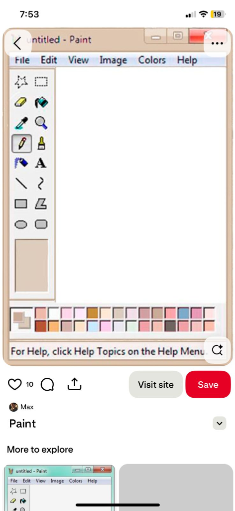
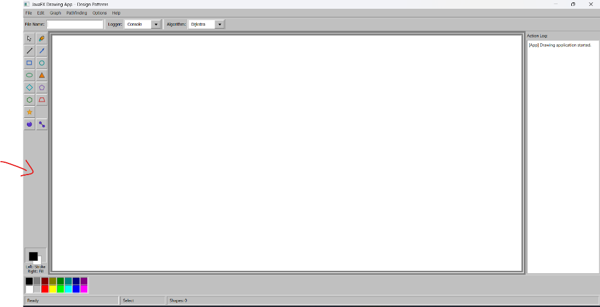

# 🎨 JavaFX Drawing Application with Design Patterns

A highly structured, modern JavaFX desktop drawing and graph modeling application. This project was developed as a university-level software architecture study to demonstrate **clean code**, **SOLID principles**, and the practical application of **Gang of Four (GoF) Design Patterns**.

---

## 📑 Table of Contents
1. [Project Overview](#-project-overview)
2. [Project Structure](#-project-structure)
3. [Design Patterns Applied](#-design-patterns-applied)
4. [SOLID Principles Compliance](#-solid-principles-compliance)
5. [Storage Strategies & File Persistence](#-storage-strategies--file-persistence)
6. [Logging Strategies](#-logging-strategies)
7. [Database Schema](#-database-schema)
8. [Graph Modeling & Pathfinding](#-graph-modeling--pathfinding)
9. [How to Run the Application](#-how-to-run-the-application)
10. [Visual Walkthrough (Screenshots)](#-visual-walkthrough-screenshots)
11. [UML Documentation](#-uml-documentation)

---

## 🎯 Project Overview
This application provides an interactive canvas allowing users to:
* Draw and paint standard geometric shapes (Rectangles, Circles, Lines, Triangles, Ellipses, Pentagons, Hexagons, Diamonds, Stars, Arrows, and Trapezoids).
* Build graph structures dynamically (add vertices/nodes, bind weighted edges between nodes).
* Execute interactive graph algorithms (find the shortest path using Dijkstra or Breadth-First Search).
* Execute unlimited undo/redo operations for all actions.
* Switch storage mechanisms on the fly (saving/loading from a local SQLite database or serializing to custom plain-text `.drw` files).
* Hot-swap action logging outputs (directing logs to the Console, a local file, or the SQLite database).

**Tech Stack**: Java 23, JavaFX 25, SQLite (JDBC), Maven.

---

## 🏗️ Project Structure

The project maintains a clean separation of concerns across well-defined packages:

```
project-root/
│
├── src/main/java/
│   ├── app/                 # JavaFX Application Bootstrapper (MainApp)
│   ├── command/             # Command Pattern (Undo/Redo implementation)
│   ├── controller/          # Controller Layer (MainController)
│   ├── factory/             # Factory Method Pattern (Shape creation)
│   ├── graph/               # Graph business models, strategies & algorithms
│   ├── logging/             # Strategy Pattern for Interchangeable Loggers
│   ├── model/               # Core domain objects & shapes (MVC Model)
│   ├── repository/          # Repository/DAO pattern for database persistence
│   ├── storage/             # Strategy Pattern for Drawing storage (File/DB)
│   └── util/                # UI alerts and dialog helpers
│
├── src/main/resources/
│   ├── style/               # Modern styling stylesheets (app.css)
│   └── view/                # FXML UI layouts (main-view.fxml)
│
├── docs/                    # Architectural documents and notes
├── assets/                  # Images and visual media
├── UML.md                   # Complete class mapping and UML details
├── Analyse.md               # Analytical report of patterns and architecture
├── README.md                # General project overview and setup
├── pom.xml                  # Maven Project Object Model configuration
└── run.ps1                  # PowerShell bootstrapper script
```

---

## 🧠 Design Patterns Applied

The project showcases a variety of design patterns to ensure scalability, low coupling, and clear boundaries between UI, database, business logic, and file storage:

### 1. MVC (Model-View-Controller)
* **View**: `main-view.fxml` describes the user interface structure, styled using `app.css`. The view contains no logic.
* **Model**: Domain classes (`Drawing`, `DrawableShape`, `GraphNode`, `GraphEdge`) hold the pure data and graphics representation.
* **Controller**: `MainController` handles user interactions, manages component updates, and routes requests to services/contexts.

### 2. Factory Method Pattern
* **Problem**: Decoupling the controller from concrete shape constructors (`new RectangleShape()`, `new CircleShape()`) to avoid modifying UI code when introducing new shapes.
* **Solution**: `ShapeFactory` interface and `DefaultShapeFactory` implementation.
* **Usage**: Creating a shape relies on `shapeFactory.createShape(ShapeType, startX, startY, endX, endY, stroke, fill)`. Extending the app with a new shape type requires only implementing `DrawableShape` and adding its case in the factory class.

### 3. Command Pattern
* **Problem**: Implementing history tracking, undo, and redo in an extensible way.
* **Solution**: `Command` interface representing executable actions:
  - `AddShapeCommand`: Handles shape drawing and deletion (for undo).
  - `DeleteShapeCommand`: Handles shape removal and restoration.
* **Usage**: Commands are executed and pushed onto the undo/redo history stacks managed by the `CommandManager`.

### 4. Strategy Pattern (Three Implementations)
* **A. Graph Pathfinding**: Interchanging search algorithms at runtime. Under `ShortestPathStrategy`, the user can switch between `DijkstraStrategy` (weighted shortest path) and `BFSStrategy` (unweighted hop-based path).
* **B. Logging Strategies**: Swapping log destinations at runtime. Under `LoggingStrategy`, the context can log to `ConsoleLoggingStrategy`, `FileLoggingStrategy`, or `DatabaseLoggingStrategy`.
* **C. Storage Strategies**: Swapping save targets between file-based and database-based persistence. Under `DrawingStorageStrategy`, the application uses `DatabaseDrawingStorageStrategy` or `FileDrawingStorageStrategy` dynamically.

### 5. Repository (DAO) Pattern
* **Problem**: Separating database connection management and SQL execution from business services and controllers.
* **Solution**: `DrawingRepository`, `ShapeRepository`, and `LogRepository` implement abstract data access operations. The controller and services communicate only through these repositories, hiding SQLite queries.

### 6. Observer Pattern
* **Usage**: JavaFX's `ObservableList` triggers automatic UI updates whenever the list of shapes in the active `Drawing` model changes.

---

## 📏 SOLID Principles Compliance

* **Single Responsibility Principle (SRP)**: Each class has a single, well-defined responsibility. For example, `DrawingFileSerializer` only parses and serializes `.drw` files, while `MainController` only handles UI events.
* **Open/Closed Principle (OCP)**: Adding new shapes or pathfinding algorithms requires creating new classes implementing `DrawableShape` or `ShortestPathStrategy` and registering them in the factory or UI, without changing existing core controller logic.
* **Liskov Substitution Principle (LSP)**: All shapes (including `GraphNode` and `GraphEdge`) extend `AbstractShape` (which implements `DrawableShape`) and can be transparently substituted in canvas operations, hit detections, and drawing logic.
* **Interface Segregation Principle (ISP)**: Interfaces are kept highly cohesive and small (e.g., `Command` contains only `execute()` and `undo()`; `ShapeFactory` contains only `createShape()`).
* **Dependency Inversion Principle (DIP)**: High-level modules do not depend directly on low-level modules; instead, they depend on abstractions (e.g., `MainController` depends on `ShapeFactory`, `LoggingStrategy`, and `DrawingStorageStrategy` interfaces).

---

## 💾 Storage Strategies & File Persistence

The application employs a dedicated strategy system to swap persistence modes on the fly using a combobox selector:

1. **Database Mode**:
   - Saves drawing metadata and individual shapes directly into local SQLite relational tables.
   - Restores drawings via a custom list dialog.
2. **File Mode**:
   - Prompts the user with native `FileChooser` dialogs to open and save drawings in a plain-text `.drw` format.
   - **Robust Decimal Handling**: The file parser automatically supports both comma-separated (e.g., `295,200000`) and dot-separated (e.g., `295.200000`) coordinates, ensuring compatibility across different OS locales (such as French and US).
   - **Standard Desktop Workflow**: Saves follow standard document behavior (Ctrl+S workflow)—first-time saves prompt with a dialog, subsequent saves silently overwrite the active path, and "Save As" forces a location prompt and copies the file.

---

## 📝 Logging Strategies

Action logging is decoupled using the Strategy Pattern, allowing you to route application event logs to three outputs:
* **Console Logger**: Outputs events directly to the system console.
* **File Logger**: Appends event logs to a local file (`logs/app.log`) with structured timestamps.
* **Database Logger**: Writes structured logs to the SQLite `logs` table for persistent auditing.

---

## 🗄️ Database Schema

The SQLite schema is automatically generated on startup in `drawing_app.db` via `DatabaseManager`:

```sql
-- Drawings table stores metadata
CREATE TABLE IF NOT EXISTS drawings (
    id INTEGER PRIMARY KEY AUTOINCREMENT,
    name TEXT NOT NULL,
    created_at TEXT NOT NULL
);

-- Shapes table stores individual shapes linked to a drawing
CREATE TABLE IF NOT EXISTS shapes (
    id INTEGER PRIMARY KEY AUTOINCREMENT,
    drawing_id INTEGER NOT NULL,
    type TEXT NOT NULL,
    start_x REAL, start_y REAL,
    end_x REAL, end_y REAL,
    width REAL, height REAL, radius REAL,
    stroke_color TEXT, fill_color TEXT,
    FOREIGN KEY(drawing_id) REFERENCES drawings(id) ON DELETE CASCADE
);

-- Logs table stores application action history
CREATE TABLE IF NOT EXISTS logs (
    id INTEGER PRIMARY KEY AUTOINCREMENT,
    action TEXT NOT NULL,
    details TEXT,
    created_at TEXT NOT NULL
);
```

---

## 🕸️ Graph Modeling & Pathfinding

The application includes interactive graph drawing tools:
1. **Nodes (Vertices)**: Drawn as numbered, classic-styled Win95 circular badges.
2. **Edges (Links)**: Drawn as connecting lines labeled with the edge weight. Dragging a node automatically updates all attached edge coordinates dynamically.
3. **Pathfinding execution**:
   - Select an algorithm (Dijkstra or BFS) from the dropdown.
   - Click **Pathfinding → Find Path**.
   - Input the source node ID and destination node ID.
   - The application visually highlights the resulting shortest path nodes and edges in deep retro navy blue.

---

## 🚀 How to Run the Application

### Method 1: Running with PowerShell Script (Recommended)
We provide a bootstrapper script (`run.ps1`) that automatically compiles the codebase, resolves the classpath including the JDBC drivers, and launches JavaFX:

1. Open a PowerShell terminal in the project directory.
2. Run:
   ```powershell
   .\run.ps1
   ```

### Method 2: Running in IntelliJ IDEA
1. Open IntelliJ and select **Open** on the project root folder.
2. Ensure **JDK 23** is selected as the Project SDK (**File → Project Structure → Project**).
3. Open **Run → Edit Configurations**.
4. Click **+** and create a new **Application** configuration:
   - **Name**: `JavaFX Drawing App`
   - **Main class**: `app.MainApp`
   - **VM options**:
     ```text
     --module-path "javafx-sdk-path/lib" --add-modules javafx.controls,javafx.fxml --add-opens javafx.fxml/javafx.fxml=ALL-UNNAMED
     ```
     *(Make sure to adjust `javafx-sdk-path` to the absolute path of your JavaFX SDK lib folder)*
5. Save the configuration and click **Run ▶**.

---

## 📸 Visual Walkthrough (Screenshots)

### Main Canvas & Retro Interface
The application features a warm, modern vintage aesthetic inspired by classic desktop software, coffee-toned workspaces, and clean flat designs.



### Storage Strategy Selector & Logs
Seamlessly switch between Database and File storage, and view runtime action log feeds on the right panel.



---

## 📊 UML Documentation

For a detailed class mapping, relations, and implementation details of the design patterns, please refer to [UML.md](UML.md).
