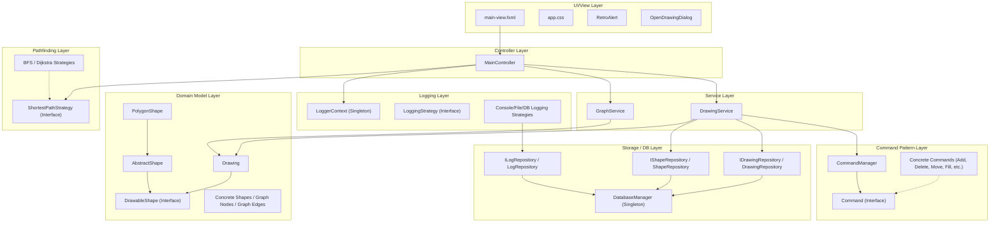
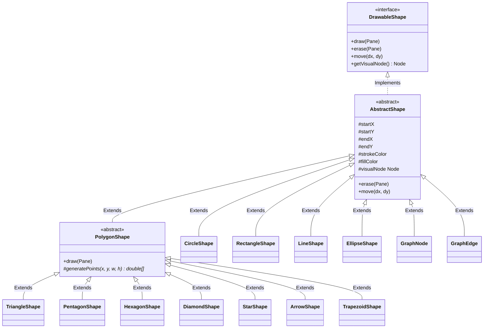
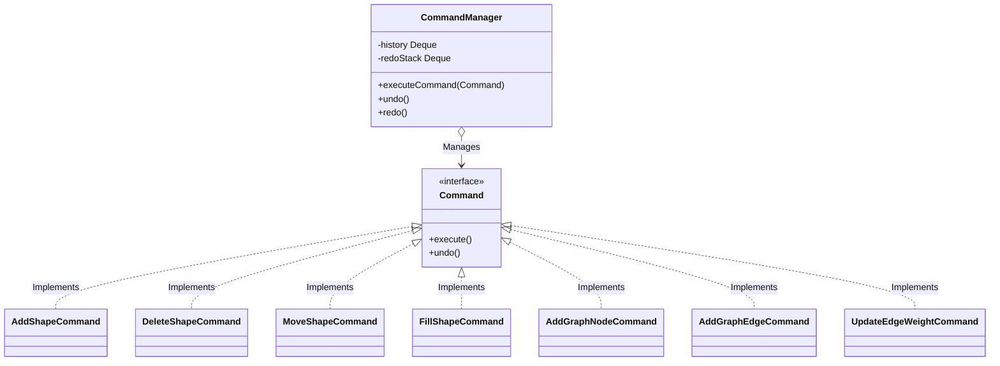
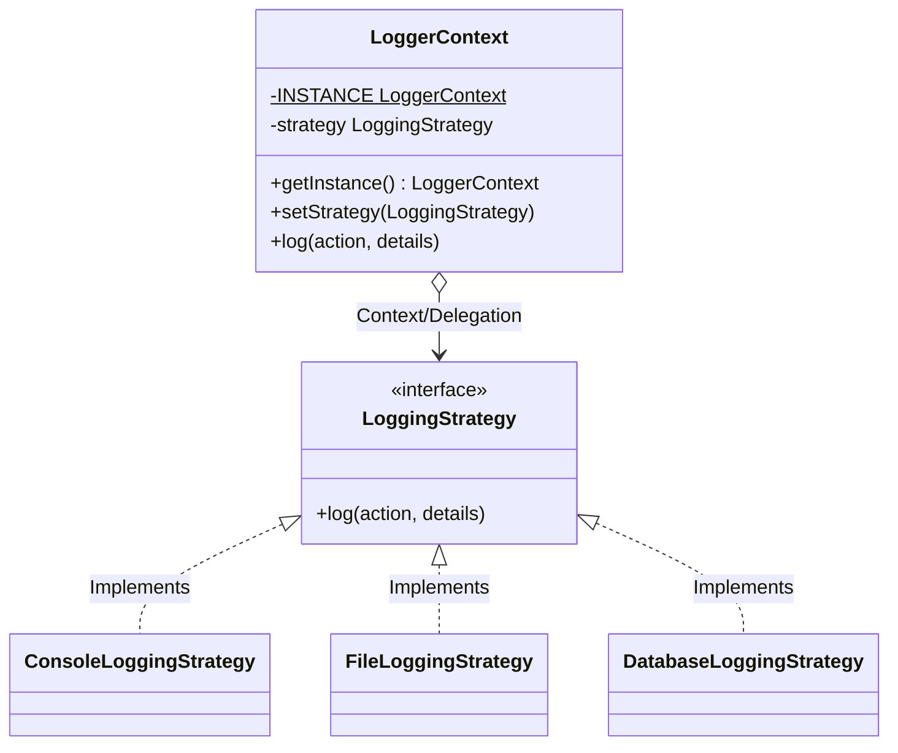

# UML Class Diagram Documentation - JavaFX Drawing & Graph Application

This document acts as a comprehensive reference guide to facilitate the manual creation of the UML Class Diagram for the JavaFX Drawing Application. It describes all classes, interfaces, and enums, outlining their attributes, methods, relationships, design pattern roles, and architectural alignment.

---

## 1. Application Architecture Overview

The application follows a clean, decoupled architecture based on the **Model-View-Controller (MVC)** architectural pattern, enriched with multiple classic design patterns. The codebase strictly separates responsibilities into logical layers:

---

## 2. MVC Structure

*   **Model**: Represents the core data entities. The main model is `Drawing` which contains metadata (ID, name, creation timestamp) and a collection of `DrawableShape` objects representing geometry and graph elements.
*   **View**: Composed of `main-view.fxml` defining the layout and SVG icons, styled via `app.css`. Also includes dialog views managed by `RetroAlert` and `OpenDrawingDialog`.
*   **Controller**: `MainController` handles user interactions (mouse clicks, drags, menu selection, color picks) and forwards operations to the service layer.

---

## 3. UI/View Classes

These classes represent custom dialog elements that supplement the XML-defined FXML view layout.

### OpenDrawingDialog
*   **Class Type**: Class
*   **Responsibility**: Presents a retro Windows 95/98 style modal dialog containing a list of saved drawings from the database, allowing the user to select and load an existing drawing.
*   **Layer**: UI/View
*   **Main Attributes**: None (utilizes local variables inside static methods).
*   **Main Methods**:
    *   `+ show(drawings : List<Drawing>) : Optional<Drawing>` (Static) $\rightarrow$ Instantiates and runs the dialog pane, rendering drawings in a styled ListView and returns the selected `Drawing` object.
*   **Relationships**:
    *   Depends on `Drawing` (model).
    *   Depends on `RetroAlert` (utility dialogs).
*   **Design Pattern Role**: View component / Custom Dialog helper.

### RetroAlert
*   **Class Type**: Class
*   **Responsibility**: A custom Windows 95/98 themed alert system that displays alerts, confirmations, prompts, and combo choice boxes using JavaFX components.
*   **Layer**: UI/View
*   **Main Attributes**:
    *   `- confirmResult : boolean` (Static) $\rightarrow$ Stores the user selection for confirmation dialogues.
    *   `- promptResult : String` (Static) $\rightarrow$ Stores the user input from prompts.
*   **Main Methods**:
    *   `+ showInfo(title : String, message : String) : void` (Static) $\rightarrow$ Displays an info dialog box.
    *   `+ showWarning(title : String, message : String) : void` (Static) $\rightarrow$ Displays a warning dialog box.
    *   `+ showError(title : String, message : String) : void` (Static) $\rightarrow$ Displays an error dialog box.
    *   `+ confirm(title : String, message : String) : boolean` (Static) $\rightarrow$ Displays Yes/No buttons and returns the user's choice.
    *   `+ prompt(title : String, message : String, defaultValue : String) : Optional<String>` (Static) $\rightarrow$ Displays a text input box.
    *   `+ choice(title : String, message : String, choices : List<String>) : Optional<String>` (Static) $\rightarrow$ Displays a drop-down select dialog box.
    *   `- createTitleBar(title : String, stage : Stage) : HBox` (Static) $\rightarrow$ Generates the custom title bar with drag handler support.
    *   `- createWin95Button(text : String, action : Runnable) : Button` (Static) $\rightarrow$ Builds a retro beveled button with pressed styling.
    *   `- createIcon(type : RetroIcon) : Node` (Static) $\rightarrow$ Generates vector shapes for warning, info, error, and question icons.
*   **Relationships**:
    *   Uses nested `ButtonChoice` class (Composition).
    *   Uses `RetroIcon` enum (Association).
*   **Design Pattern Role**: Custom Dialog Component.

### RetroAlert.ButtonChoice
*   **Class Type**: Static Inner Class (Nested within `RetroAlert`)
*   **Responsibility**: Represents an action linked to a button in the custom alert.
*   **Layer**: UI/View
*   **Main Attributes**:
    *   `~ text : String` (Package-private) $\rightarrow$ Button label text.
    *   `~ action : Runnable` (Package-private) $\rightarrow$ Callback logic to run when clicked.
*   **Relationships**:
    *   Composition by `RetroAlert`.

---

## 4. Controllers

### MainController
*   **Class Type**: Class
*   **Responsibility**: Wires the JavaFX FXML view to the service layers, responding to mouse inputs on the canvas pane and updating the view hierarchy, status bar, and log list.
*   **Layer**: Controller
*   **Main Attributes**:
    *   `- shapePane : Pane` (FXML) $\rightarrow$ Drawing canvas container.
    *   `- drawingNameField : TextField` (FXML) $\rightarrow$ Input field for the drawing's name.
    *   `- shapeToggleGroup : ToggleGroup` (FXML) $\rightarrow$ Logical grouping for shape tool buttons.
    *   `- rectBtn, circleBtn, lineBtn, nodeBtn, edgeBtn, triangleBtn, ellipseBtn, pentagonBtn, hexagonBtn, diamondBtn, starBtn, fillBtn, arrowBtn, trapezoidBtn, selectBtn : ToggleButton` (FXML) $\rightarrow$ Tool buttons.
    *   `- logStrategyCombo : ComboBox<String>` (FXML) $\rightarrow$ Dropdown to switch log outputs.
    *   `- algorithmCombo : ComboBox<String>` (FXML) $\rightarrow$ Dropdown to choose Dijkstra or BFS.
    *   `- actionLogView : ListView<String>` (FXML) $\rightarrow$ Display panel for live logs.
    *   `- colorGrid : HBox` (FXML) $\rightarrow$ HBox containing the color palette grid.
    *   `- activeStrokeRect, activeFillRect : Rectangle` (FXML) $\rightarrow$ Previews current outline/fill colors.
    *   `- currentStrokeColor, currentFillColor : Color` $\rightarrow$ Stroke and fill paint objects.
    *   `- statusLabel, shapeCountLabel, modeLabel : Label` (FXML) $\rightarrow$ Status bar text labels.
    *   `- drawingService : DrawingService` $\rightarrow$ Service handling shape collections and undo history.
    *   `- shapeFactory : ShapeFactory` $\rightarrow$ Interface to produce shape instances.
    *   `- logger : LoggerContext` $\rightarrow$ Accesses the logging facade.
    *   `- graphService : GraphService` $\rightarrow$ Handles graph logic and node-edge tracking.
    *   `- pendingEdgeSource : GraphNode` $\rightarrow$ Stores source node during graph edge selection.
    *   `- drawingRepo : IDrawingRepository` $\rightarrow$ Repository interface for drawings.
    *   `- logRepo : ILogRepository` $\rightarrow$ Repository interface for logs.
    *   `- pressX, pressY : double` $\rightarrow$ Starting coordinates of mouse gestures.
    *   `- previewShape : Shape` $\rightarrow$ Real-time dashed preview shape.
    *   `- selectedShape : DrawableShape` $\rightarrow$ The active selected shape object.
    *   `- selectionBorder : Shape` $\rightarrow$ Visually represents shape selection.
    *   `- isDraggingSelectedShape : boolean` $\rightarrow$ True if moving an item.
    *   `- lastDragX, lastDragY : double` $\rightarrow$ Mouse drag coordinate trackers.
    *   `- dragTotalDX, dragTotalDY : double` $\rightarrow$ Total displacement vectors.
*   **Main Methods**:
    *   `+ initialize() : void` (FXML) $\rightarrow$ Configures services, default console logger, color grids, and UI listeners.
    - `@FXML private void onNewDrawing() : void` $\rightarrow$ Resets current drawing state.
    - `@FXML private void onSave() : void` $\rightarrow$ Save shapes to database.
    - `@FXML private void onOpen() : void` $\rightarrow$ Loads an existing drawing.
    - `@FXML private void onExit() : void` $\rightarrow$ Shuts down application.
    - `@FXML private void onUndo() : void` $\rightarrow$ Calls `DrawingService.undo()`.
    - `@FXML private void onRedo() : void` $\rightarrow$ Calls `DrawingService.redo()`.
    - `@FXML private void onDelete() : void` $\rightarrow$ Executes `DeleteShapeCommand` on selected shape.
    - `@FXML private void onClear() : void` $\rightarrow$ Resets drawing state with confirmation.
    - `@FXML private void onCanvasMousePressed(MouseEvent e) : void` $\rightarrow$ Registers gesture start, detects hit shapes, or updates color-fill click.
    - `@FXML private void onCanvasMouseDragged(MouseEvent e) : void` $\rightarrow$ Renders preview or translates selected shapes.
    - `@FXML private void onCanvasMouseReleased(MouseEvent e) : void` $\rightarrow$ Spawns final shapes and records transactions.
    - `@FXML private void onFindPath() : void` $\rightarrow$ Executes pathfinding algorithm and highlights nodes/edges.
    - `@FXML private void onClearPath() : void` $\rightarrow$ Resets node/edge highlighting.
    - `- selectShape(shape : DrawableShape) : void` $\rightarrow$ Attaches selection bounds.
    - `- removeSelectionBorder() : void` $\rightarrow$ Clears selection bounds.
    - `- getSelectedType() : ShapeType` $\rightarrow$ Returns active toolbar type.
    - `- buildPreview(type : ShapeType, sx : double, sy : double, ex : double, ey : double) : Shape` $\rightarrow$ Creates dynamic JavaFX preview outline.
    - `- findNodeAt(x : double, y : double) : GraphNode` $\rightarrow$ Scans nodes matching coordinates.
    - `- addToLog(action : String, details : String) : void` $\rightarrow$ Dispatches actions to logging context and appends to GUI list.
*   **Relationships**:
    *   Controller in the core MVC architecture.
    *   Uses `DrawingService` (Association).
    *   Uses `GraphService` (Association).
    *   Uses `ShapeFactory` interface (Dependency Inversion $\rightarrow$ DefaultShapeFactory).
    *   Uses `LoggerContext` (Association).
    *   Depends on `IDrawingRepository`, `ILogRepository` (Dependency Inversion).
    *   Depends on concrete commands: `AddShapeCommand`, `DeleteShapeCommand`, `MoveShapeCommand`, `FillShapeCommand`, `AddGraphNodeCommand`, `AddGraphEdgeCommand`, `UpdateEdgeWeightCommand`.
*   **Design Pattern Role**: Controller in MVC.

---

## 5. Models

These classes encapsulate core data objects and properties without being tied to a specific UI controller.

### Drawing
*   **Class Type**: Class
*   **Responsibility**: Serves as the primary data container representing a document, tracking name, ID, and database creation timestamp.
*   **Layer**: Model
*   **Main Attributes**:
    *   `- id : int` $\rightarrow$ Primary key ID in Database.
    *   `- name : String` $\rightarrow$ Drawing name.
    *   `- createdAt : String` $\rightarrow$ Creation timestamp.
    *   `- shapes : ObservableList<DrawableShape>` (final) $\rightarrow$ The active list of shapes.
*   **Main Methods**:
    *   `+ addShape(s : DrawableShape) : void` $\rightarrow$ Appends shape.
    *   `+ removeShape(s : DrawableShape) : void` $\rightarrow$ Deletes shape.
    *   `+ toString() : String` $\rightarrow$ Return formatted display label.
*   **Relationships**:
    *   Contains list of `DrawableShape` (Aggregation).
*   **Design Pattern Role**: Model in MVC, Observable Subject (via `ObservableList`).

### DrawableShape
*   **Class Type**: Interface
*   **Responsibility**: Defines the uniform abstraction contract representing any shape drawn on the screen, detailing drawing bounds, rendering nodes, translation behavior, and stroke/fill colors.
*   **Layer**: Model
*   **Main Methods**:
    *   `+ draw(pane : Pane) : void` $\rightarrow$ Renders shape.
    *   `+ erase(pane : Pane) : void` $\rightarrow$ Removes shape visual elements.
    *   `+ move(dx : double, dy : double) : void` $\rightarrow$ Translates layout offsets.
    *   `+ getVisualNode() : Node` $\rightarrow$ Retrieves associated JavaFX Node.
*   **Relationships**:
    *   Extended by all concrete shape elements.
*   **Design Pattern Role**: Common abstraction in **Factory Method** and **Command** patterns.

### AbstractShape
*   **Class Type**: Abstract Class
*   **Responsibility**: Implements common boilerplates of the `DrawableShape` interface, storing bounding box vectors, color hex Strings, ID identifiers, and the default implementation for erasing and moving shapes.
*   **Layer**: Model
*   **Main Attributes**:
    *   `# id : String` $\rightarrow$ Unique identifier.
    *   `# type : ShapeType` $\rightarrow$ Geometry categorization.
    *   `# startX, startY, endX, endY : double` $\rightarrow$ Position coordinates.
    *   `# width, height, radius : double` $\rightarrow$ Dimension properties.
    *   `# strokeColor, fillColor : String` $\rightarrow$ Outlines/interior color hex.
    *   `# visualNode : Node` $\rightarrow$ Active reference to JavaFX visual node.
*   **Main Methods**:
    *   `+ erase(pane : Pane) : void` $\rightarrow$ Deletes `visualNode` child from `Pane`.
    *   `+ move(dx : double, dy : double) : void` $\rightarrow$ Displaces positions and updates `visualNode` layout offsets.
*   **Relationships**:
    *   Implements `DrawableShape`.
*   **Design Pattern Role**: Base Class in the **Template Method** pattern (concrete classes define `draw()`).

---

## 6. Shape System

The shape system contains standard geometry components that extend `AbstractShape` or `PolygonShape`.

### CircleShape
*   **Class Type**: Class
*   **Responsibility**: Concrete representation of a circular outline/fill.
*   **Layer**: Model
*   **Main Methods**:
    *   `+ draw(pane : Pane) : void` $\rightarrow$ Calculates center coordinate and radius, instantiates a `javafx.scene.shape.Circle` and adds to the parent pane.

### RectangleShape
*   **Class Type**: Class
*   **Responsibility**: Concrete representation of a rectangular outline/fill.
*   **Layer**: Model
*   **Main Methods**:
    *   `+ draw(pane : Pane) : void` $\rightarrow$ Instantiates `javafx.scene.shape.Rectangle` using start and drag positions.

### LineShape
*   **Class Type**: Class
*   **Responsibility**: Concrete representation of a straight line segment.
*   **Layer**: Model
*   **Main Methods**:
    *   `+ draw(pane : Pane) : void` $\rightarrow$ Instantiates `javafx.scene.shape.Line`.

### EllipseShape
*   **Class Type**: Class
*   **Responsibility**: Concrete representation of an ellipse geometry.
*   **Layer**: Model
*   **Main Methods**:
    *   `+ draw(pane : Pane) : void` $\rightarrow$ Instantiates `javafx.scene.shape.Ellipse`.

### PolygonShape
*   **Class Type**: Abstract Class
*   **Responsibility**: An intermediate abstract subclass designed to handle the boilerplate of drawing closed polygon shapes, delegating only the vertex calculation to its subclasses.
*   **Layer**: Model
*   **Main Methods**:
    *   `+ draw(pane : Pane) : void` $\rightarrow$ Generates coordinates using the abstract method and instantiates a `javafx.scene.shape.Polygon`.
    *   `# generatePoints(x : double, y : double, w : double, h : double) : double[]` (Protected, Abstract) $\rightarrow$ Must be overridden by subclasses to define vertex list bounds.
*   **Relationships**:
    *   Extends `AbstractShape`.
*   **Design Pattern Role**: Template Method base class.

### TriangleShape
*   **Class Type**: Class $\rightarrow$ Extends `PolygonShape`
*   **Responsibility**: Generates three vertex coordinates forming a triangle.

### PentagonShape
*   **Class Type**: Class $\rightarrow$ Extends `PolygonShape`
*   **Responsibility**: Generates coordinates of a five-sided polygon.

### HexagonShape
*   **Class Type**: Class $\rightarrow$ Extends `PolygonShape`
*   **Responsibility**: Generates coordinates of a six-sided polygon.

### DiamondShape
*   **Class Type**: Class $\rightarrow$ Extends `PolygonShape`
*   **Responsibility**: Generates coordinates representing a diamond shape.

### StarShape
*   **Class Type**: Class $\rightarrow$ Extends `PolygonShape`
*   **Responsibility**: Generates coordinates for a 5-point star.

### ArrowShape
*   **Class Type**: Class $\rightarrow$ Extends `PolygonShape`
*   **Responsibility**: Generates coordinates for a block arrow.

### TrapezoidShape
*   **Class Type**: Class $\rightarrow$ Extends `PolygonShape`
*   **Responsibility**: Generates coordinates forming a symmetric trapezoid.

---

## 7. Graph System

The graph system represents the vertices and edges of a graph structure, overlaying a logical topology on top of the drawing canvas.

### Graph
*   **Class Type**: Class
*   **Responsibility**: Represents the graph's topology (adjacency matrix/list equivalent) in memory, containing lists of nodes and edges, and utility lookup methods.
*   **Layer**: Graph
*   **Main Attributes**:
    *   `- nodes : List<GraphNode>` (final) $\rightarrow$ In-memory node collection.
    *   `- edges : List<GraphEdge>` (final) $\rightarrow$ In-memory edge collection.
*   **Main Methods**:
    *   `+ addNode(node : GraphNode) : void` $\rightarrow$ Registers a node.
    *   `+ removeNode(node : GraphNode) : void` $\rightarrow$ Removes node and its connected edges.
    *   `+ addEdge(edge : GraphEdge) : void` $\rightarrow$ Registers an edge.
    *   `+ removeEdge(edge : GraphEdge) : void` $\rightarrow$ Removes an edge.
    *   `+ edgesFrom(node : GraphNode) : List<GraphEdge>` $\rightarrow$ Filters edges connected to a specific node.
    *   `+ getNeighbour(edge : GraphEdge, from : GraphNode) : GraphNode` $\rightarrow$ Retrieves target node linked by edge.
    *   `+ getNextAvailableNodeId() : int` $\rightarrow$ Generates unique incrementing vertex IDs.
    *   `+ findEdgeBetween(a : GraphNode, b : GraphNode) : GraphEdge` $\rightarrow$ Checks for an edge between two nodes.
*   **Relationships**:
    *   Contains list of `GraphNode` (Composition).
    *   Contains list of `GraphEdge` (Composition).
*   **Design Pattern Role**: Model component representing Graph topology.

### GraphNode
*   **Class Type**: Class
*   **Responsibility**: A vertex inside the graph model. It acts as a custom `DrawableShape` visually represented as a Circle containing an ID label.
*   **Layer**: Graph / Model
*   **Main Attributes**:
    *   `+ NODE_RADIUS : double = 22` (Static, Constant) $\rightarrow$ Node dimensions.
    *   `- label : String` $\rightarrow$ ID text representation.
    *   `- nodeId : int` $\rightarrow$ Unique vertex identifier.
*   **Main Methods**:
    *   `+ draw(pane : Pane) : void` $\rightarrow$ Builds a `javafx.scene.Group` enclosing a `Circle` and text object.
    *   `+ highlight(on : boolean) : void` $\rightarrow$ Visually highlights node for path visualization.
    *   `+ getCenterX() : double`, `+ getCenterY() : double` $\rightarrow$ Math calculations for edge anchor lines.
*   **Relationships**:
    *   Extends `AbstractShape`.
*   **Design Pattern Role**: Substituted as `DrawableShape` (LSP).

### GraphEdge
*   **Class Type**: Class
*   **Responsibility**: A weighted directed edge between two `GraphNode` vertices. It is a `DrawableShape` rendered as a Line with a floating weight label.
*   **Layer**: Graph / Model
*   **Main Attributes**:
    *   `- source : GraphNode` $\rightarrow$ Start vertex reference.
    *   `- target : GraphNode` $\rightarrow$ End vertex reference.
    *   `- weight : double` $\rightarrow$ Numeric weight value.
*   **Main Methods**:
    *   `+ draw(pane : Pane) : void` $\rightarrow$ Groups a line and weight text object.
    *   `+ highlight(on : boolean) : void` $\rightarrow$ Highlights edge along path.
    *   `+ updateCoordinates() : void` $\rightarrow$ Recalculates end points during node movement.
    *   `+ bindToNodes(nodes : List<GraphNode>) : void` $\rightarrow$ Links source/target references based on coordinate proximity (used when loading from DB).
*   **Relationships**:
    *   Extends `AbstractShape`.
    *   Association with `GraphNode` (source and target).
*   **Design Pattern Role**: Substituted as `DrawableShape` (LSP).

---

## 8. Command Pattern Classes

Implementation of the Command Pattern to decouple the actions performed on the UI from their execution and support undo/redo stacks.

### Command
*   **Class Type**: Interface
*   **Responsibility**: Abstraction detailing standard transactional execution logic.
*   **Layer**: Command
*   **Main Methods**:
    *   `+ execute() : void` $\rightarrow$ Runs action.
    *   `+ undo() : void` $\rightarrow$ Reverses action.

### CommandManager
*   **Class Type**: Class
*   **Responsibility**: Stores command history logs into dual Double-Ended Queues (history and redo stacks) to handle standard undo/redo states.
*   **Layer**: Command
*   **Main Attributes**:
    *   `- history : Deque<Command>` (final) $\rightarrow$ Executed history queue.
    *   `- redoStack : Deque<Command>` (final) $\rightarrow$ Undone history queue.
*   **Main Methods**:
    *   `+ executeCommand(cmd : Command) : void` $\rightarrow$ Triggers command execution, pushes to history, and purges redo history.
    *   `+ undo() : void` $\rightarrow$ Pops history command, triggers undo, and inserts to redo stack.
    *   `+ redo() : void` $\rightarrow$ Pops redo command, executes, and pushes to history stack.
    *   `+ canUndo() : boolean`, `+ canRedo() : boolean` $\rightarrow$ UI button enable status flags.
    *   `+ clear() : void` $\rightarrow$ Empties stacks.
*   **Relationships**:
    *   Aggregates `Command` (Interface Dependency).
*   **Design Pattern Role**: Invoker/History manager in the **Command** pattern.

### AddShapeCommand
*   **Class Type**: Class
*   **Responsibility**: Encloses logic to append a standard drawing shape into both the `Drawing` model and `shapePane` view.
*   **Layer**: Command
*   **Main Attributes**:
    *   `- drawing : Drawing` (final) $\rightarrow$ Model document.
    *   `- shape : DrawableShape` (final) $\rightarrow$ Target shape.
    *   `- pane : Pane` (final) $\rightarrow$ Canvas container.
*   **Relationships**:
    *   Implements `Command`.
    *   Association with `Drawing` and `DrawableShape`.

### AddGraphNodeCommand
*   **Class Type**: Class
*   **Responsibility**: Handles transaction lifecycle of creating a graph vertex node.
*   **Layer**: Command
*   **Main Attributes**:
    *   `- drawing : Drawing`
    *   `- node : GraphNode`
    *   `- pane : Pane`
    *   `- graphService : GraphService`
*   **Relationships**:
    *   Implements `Command`.
    *   Association with `Drawing`, `GraphNode`, and `GraphService`.

### AddGraphEdgeCommand
*   **Class Type**: Class
*   **Responsibility**: Handles transaction lifecycle of creating a graph edge.
*   **Layer**: Command
*   **Main Attributes**:
    *   `- drawing : Drawing`
    *   `- edge : GraphEdge`
    *   `- pane : Pane`
    *   `- graphService : GraphService`
*   **Relationships**:
    *   Implements `Command`.
    *   Association with `Drawing`, `GraphEdge`, and `GraphService`.

### DeleteShapeCommand
*   **Class Type**: Class
*   **Responsibility**: Transaction logic to remove a shape, node, or edge. If a node is deleted, it records and removes all connected edges, allowing full restoration during undo.
*   **Layer**: Command
*   **Main Attributes**:
    *   `- drawing : Drawing` (final)
    *   `- shape : DrawableShape` (final)
    *   `- pane : Pane` (final)
    *   `- graphService : GraphService` (final)
    *   `- removedEdges : List<GraphEdge>` $\rightarrow$ Caches connected edges to restore on undo.
*   **Relationships**:
    *   Implements `Command`.
    *   Association with `Drawing`, `DrawableShape`, and `GraphService`.

### FillShapeCommand
*   **Class Type**: Class
*   **Responsibility**: Transaction logic for color-filling closed shapes.
*   **Layer**: Command
*   **Main Attributes**:
    *   `- shape : DrawableShape` (final)
    *   `- newFill : String` (final) $\rightarrow$ Color string to apply.
    *   `- oldFill : String` (final) $\rightarrow$ Previous color to restore on undo.
*   **Relationships**:
    *   Implements `Command`.
    *   Association with `DrawableShape`.

### MoveShapeCommand
*   **Class Type**: Class
*   **Responsibility**: Transaction logic for moving shapes or graph nodes. Moving a node also updates coordinate vectors on all connected edges.
*   **Layer**: Command
*   **Main Attributes**:
    *   `- drawing : Drawing` (final)
    *   `- shape : DrawableShape` (final)
    *   `- dx, dy : double` (final) $\rightarrow$ Displacement values.
    *   `- graphService : GraphService` (final)
*   **Relationships**:
    *   Implements `Command`.
    *   Association with `Drawing`, `DrawableShape`, and `GraphService`.

### UpdateEdgeWeightCommand
*   **Class Type**: Class
*   **Responsibility**: Transaction logic to change an edge weight.
*   **Layer**: Command
*   **Main Attributes**:
    *   `- edge : GraphEdge` (final)
    *   `- oldWeight : double` (final)
    *   `- newWeight : double` (final)
*   **Relationships**:
    *   Implements `Command`.
    *   Association with `GraphEdge`.

---

## 9. Logging System

The logging system uses the Strategy pattern to support logging transactions to the standard console output, a log file, or the SQLite database.

### LoggingStrategy
*   **Class Type**: Interface
*   **Responsibility**: Defines the common log entry writer contract.
*   **Layer**: Logging
*   **Main Methods**:
    *   `+ log(action : String, details : String) : void` $\rightarrow$ Logs an action with details.

### LoggerContext
*   **Class Type**: Class
*   **Responsibility**: Singleton logging context that acts as a facade, forwarding all log requests to the active strategy.
*   **Layer**: Logging
*   **Main Attributes**:
    *   `- INSTANCE : LoggerContext` (Static, Constant) $\rightarrow$ The single active instance.
    *   `- strategy : LoggingStrategy` $\rightarrow$ Reference to active logging strategy.
*   **Main Methods**:
    *   `+ getInstance() : LoggerContext` (Static) $\rightarrow$ Returns instance reference.
    *   `+ setStrategy(strategy : LoggingStrategy) : void` $\rightarrow$ Runtime hot-swap modifier.
    *   `+ log(action : String, details : String) : void` $\rightarrow$ Delegates to strategy.
*   **Relationships**:
    *   Has-a `LoggingStrategy` (Aggregation).
*   **Design Pattern Role**: Context in the **Strategy** pattern, **Singleton** pattern.

### ConsoleLoggingStrategy
*   **Class Type**: Class
*   **Responsibility**: Logs to standard output.
*   **Layer**: Logging
*   **Relationships**: Implements `LoggingStrategy`.

### FileLoggingStrategy
*   **Class Type**: Class
*   **Responsibility**: Writes log entries to the file `logs/actions.log`.
*   **Layer**: Logging
*   **Main Attributes**:
    *   `- LOG_FILE : String = "logs/actions.log"` (Static, Constant)
*   **Relationships**: Implements `LoggingStrategy`.

### DatabaseLoggingStrategy
*   **Class Type**: Class
*   **Responsibility**: Writes log entries to the database via `ILogRepository`.
*   **Layer**: Logging
*   **Main Attributes**:
    *   `- logRepository : ILogRepository` (final) $\rightarrow$ Database logger API.
*   **Relationships**:
    *   Implements `LoggingStrategy`.
    *   Depends on `ILogRepository` (Dependency Inversion).

---

## 10. Storage/Database System

Provides database connectivity and executes CRUD queries for drawings, shapes, nodes, edges, and application log events.

### DatabaseManager
*   **Class Type**: Class
*   **Responsibility**: Manages the SQL database connection, establishing the connection pool and creating the initial table schemas if they do not exist.
*   **Layer**: Storage/Database
*   **Main Attributes**:
    *   `- DB_URL_BASE : String = "jdbc:mysql://localhost:3306/"` (Static, Constant)
    *   `- DB_NAME : String = "drawing_app"` (Static, Constant)
    *   `- DB_PARAMS : String = "?allowPublicKeyRetrieval=true&useSSL=false"` (Static, Constant)
    *   `- USER : String = "root"` (Static, Constant)
    *   `- PASS : String = ""` (Static, Constant)
    *   `- instance : DatabaseManager` (Static) $\rightarrow$ Singleton instance.
    *   `- connection : Connection` $\rightarrow$ Database connection object.
*   **Main Methods**:
    *   `+ getInstance() : DatabaseManager` (Static, Synchronized) $\rightarrow$ Double checked locking instance builder.
    *   `+ getConnection() : Connection` $\rightarrow$ Returns connection reference.
    *   `- createTables() : void` $\rightarrow$ Executes schema scripts initializing tables: `drawings`, `shapes`, `graph_nodes`, `graph_edges`, and `logs`.
*   **Design Pattern Role**: **Singleton** database access manager.

### IDrawingRepository
*   **Class Type**: Interface
*   **Responsibility**: Defines database operations for the `Drawing` model.
*   **Layer**: Storage/Database
*   **Main Methods**:
    *   `+ save(drawing : Drawing) : Drawing`
    *   `+ findAll() : List<Drawing>`
    *   `+ deleteById(id : int) : void`

### DrawingRepository
*   **Class Type**: Class
*   **Responsibility**: Implements repository CRUD queries for the `drawings` table.
*   **Layer**: Storage/Database
*   **Main Attributes**:
    *   `- conn : Connection` (final)
*   **Relationships**:
    *   Implements `IDrawingRepository`.
    *   Depends on `DatabaseManager` (Association).

### IShapeRepository
*   **Class Type**: Interface
*   **Responsibility**: Defines database operations for `DrawableShape` instances.
*   **Layer**: Storage/Database
*   **Main Methods**:
    *   `+ saveAll(drawingId : int, shapes : List<DrawableShape>) : void`
    *   `+ findByDrawingId(drawingId : int) : List<DrawableShape>`

### ShapeRepository
*   **Class Type**: Class
*   **Responsibility**: Implements database queries for the `shapes`, `graph_nodes`, and `graph_edges` tables. It handles batch inserts and converts database records back into concrete shape models using the shape factory mapping.
*   **Layer**: Storage/Database
*   **Main Attributes**:
    *   `- conn : Connection` (final)
*   **Relationships**:
    *   Implements `IShapeRepository`.
    *   Depends on `DatabaseManager` (Association).
*   **Design Pattern Role**: Repository / DAO.

### ILogRepository
*   **Class Type**: Interface
*   **Responsibility**: Defines database operations for log entries.
*   **Layer**: Storage/Database
*   **Main Methods**:
    *   `+ save(action : String, details : String) : void`
    *   `+ findAll() : List<String>`

### LogRepository
*   **Class Type**: Class
*   **Responsibility**: Implements database queries for the `logs` table.
*   **Layer**: Storage/Database
*   **Main Attributes**:
    *   `- conn : Connection` (final)
*   **Relationships**:
    *   Implements `ILogRepository`.
    *   Depends on `DatabaseManager` (Association).

---

## 11. Pathfinding Algorithms

The pathfinding system uses the Strategy pattern to find paths between two selected graph nodes.

### ShortestPathStrategy
*   **Class Type**: Interface
*   **Responsibility**: Defines the strategy contract for finding a path between two nodes in a graph.
*   **Layer**: Pathfinding
*   **Main Methods**:
    *   `+ findPath(graph : Graph, start : GraphNode, end : GraphNode) : List<GraphNode>`

### BFSStrategy
*   **Class Type**: Class
*   **Responsibility**: Calculates the path between two nodes with the fewest hops (unweighted) using Breadth-First Search.
*   **Layer**: Pathfinding
*   **Relationships**: Implements `ShortestPathStrategy`.

### DijkstraStrategy
*   **Class Type**: Class
*   **Responsibility**: Calculates the path between two nodes with the lowest cumulative edge weights using Dijkstra's algorithm.
*   **Layer**: Pathfinding
*   **Relationships**: Implements `ShortestPathStrategy`.

---

## 12. Utility Classes

Helper components that encapsulate specific utility features.

### AlertUtil
*   **Class Type**: Class
*   **Responsibility**: Providing a unified facade to display custom styled dialog boxes.
*   **Layer**: Utility
*   **Main Methods**:
    *   `+ showError(title : String, msg : String) : void` (Static)
    *   `+ showInfo(title : String, msg : String) : void` (Static)
    *   `+ confirm(title : String, msg : String) : boolean` (Static)
    *   `+ prompt(title : String, prompt : String, defaultVal : String) : Optional<String>` (Static)
*   **Relationships**:
    *   Depends on `RetroAlert` (delegates dialog actions).
*   **Design Pattern Role**: **Facade** pattern wrapper.

---

## 13. Enums

### ShapeType
*   **Class Type**: Enum
*   **Responsibility**: Defines the list of available shapes and tools.
*   **Layer**: Model
*   **Values**:
    *   `RECTANGLE`, `CIRCLE`, `LINE` (Basic shapes)
    *   `TRIANGLE`, `ELLIPSE`, `PENTAGON`, `HEXAGON`, `DIAMOND`, `STAR`, `ARROW`, `TRAPEZOID` (Polygon shapes)
    *   `NODE`, `EDGE` (Graph components)
    *   `FILL` (Color bucket tool)

### RetroIcon
*   **Class Type**: Enum (Nested in `RetroAlert`)
*   **Responsibility**: Category identifier matching vector drawing icon assets.
*   **Layer**: UI/View
*   **Values**:
    *   `INFO`, `WARNING`, `ERROR`, `QUESTION`

---

## 14. Relationships Summary

The following table summarizes class relationships across the project:

| Source Class | Target Class | Relationship Type | Description |
| :--- | :--- | :--- | :--- |
| `MainApp` | `MainController` | Dependency | Loads FXML which binds and configures controller. |
| `MainController` | `DrawingService` | Association | Forwards drawing actions and undo/redo operations. |
| `MainController` | `GraphService` | Association | Delegates node creation and edge updates. |
| `MainController` | `ShapeFactory` | Dependency Inversion | Creates concrete shapes via `ShapeFactory` interface. |
| `MainController` | `LoggerContext` | Association | Directs log messages. |
| `DrawingService` | `CommandManager` | Composition | Instantiates and holds history stacks. |
| `DrawingService` | `IDrawingRepository` | Dependency Inversion | Decoupled from SQL repository implementation. |
| `DrawingService` | `IShapeRepository` | Dependency Inversion | Decoupled from SQL shape persistence. |
| `GraphService` | `Graph` | Composition | Creates and maintains graph topology. |
| `AbstractShape` | `DrawableShape` | Implementation | Base properties and common translation operations. |
| `PolygonShape` | `AbstractShape` | Inheritance | Abstract polygon drawing specialization. |
| `Concrete Shapes` | `PolygonShape`/`AbstractShape` | Inheritance | Geometric classes implementing draw/vertices calculations. |
| `GraphNode` | `AbstractShape` | Inheritance | Node is specialized as a circular shape. |
| `GraphEdge` | `AbstractShape` | Inheritance | Edge is specialized as a line shape connecting two nodes. |
| `GraphEdge` | `GraphNode` | Association | Connects source and target node endpoints. |
| `Concrete Commands` | `Command` | Implementation | Implement execution and rollback operations. |
| `CommandManager` | `Command` | Aggregation | Stores instances inside deque stack histories. |
| `Concrete Loggers` | `LoggingStrategy` | Implementation | Console, File, or Database logger engines. |
| `LoggerContext` | `LoggingStrategy` | Aggregation | Holds active logging engine. |
| `DatabaseLoggingStrategy`| `ILogRepository` | Dependency Inversion | Decoupled from SQL log table persistence. |
| `DrawingRepository` | `DatabaseManager` | Association | Gets database connection references. |
| `ShapeRepository` | `DatabaseManager` | Association | Gets database connection references. |
| `LogRepository` | `DatabaseManager` | Association | Gets database connection references. |
| `Dijkstra/BFSStrategy` | `ShortestPathStrategy` | Implementation | Path calculation algorithm options. |
| `AlertUtil` | `RetroAlert` | Dependency | Facade delegating window dialog instances. |

---

# UML DIAGRAM GUIDE

This section explains how to represent key classes and relationships when drawing the UML Class Diagram manually.

## 1. Connector and Arrow Rules

When drawing connections on your class diagram, use standard UML symbols:

| Relationship | Line Style | Arrow Style | Representation (Source $\rightarrow$ Target) |
| :--- | :--- | :--- | :--- |
| **Inheritance (Extends)** | Solid | Hollow Triangle | `CircleShape` $\blacktriangleleft$— `AbstractShape` (points to base class) |
| **Implementation (Implements)** | Dashed | Hollow Triangle | `AbstractShape` - - - $\blacktriangleleft$ `DrawableShape` (points to interface) |
| **Composition** | Solid | Solid Diamond | `Graph` $\blackdiamond$— `GraphNode` (node cannot exist without the graph) |
| **Aggregation** | Solid | Hollow Diamond | `CommandManager` $\diamond$— `Command` (commands can exist outside the manager) |
| **Association** | Solid | Pointer Arrow | `MainController` —$\rightarrow$ `DrawingService` (has reference attributes) |
| **Dependency** | Dashed | Pointer Arrow | `DefaultShapeFactory` - - - $\rightarrow$ `RectangleShape` (creates instances locally) |

---

## 2. Step-by-Step Drawing Instructions

Follow this structural workflow to lay out the classes on your canvas:

1.  **The Base Shape Hierarchy (Bottom Left)**:
    *   Draw the interface box `<<interface>> DrawableShape` at the top.
    *   Draw the abstract class box `AbstractShape` below it. Connect with a dashed line + hollow triangle: `AbstractShape` - - - $\blacktriangleleft$ `DrawableShape`.
    *   Draw `CircleShape`, `RectangleShape`, `LineShape`, `EllipseShape`, `GraphNode`, `GraphEdge`, and `PolygonShape` below `AbstractShape`. Connect them all with solid lines + hollow triangles pointing to `AbstractShape`.
    *   Draw `TriangleShape`, `PentagonShape`, `HexagonShape`, `DiamondShape`, `StarShape`, `ArrowShape`, and `TrapezoidShape` below `PolygonShape`. Connect them with solid lines + hollow triangles pointing to `PolygonShape`.

2.  **The Graph Subsystem (Bottom Center)**:
    *   Draw `Graph` next to `GraphNode` and `GraphEdge`.
    *   Connect `Graph` to `GraphNode` with a solid line + solid diamond: `Graph` $\blackdiamond$— `GraphNode`.
    *   Connect `Graph` to `GraphEdge` with a solid line + solid diamond: `Graph` $\blackdiamond$— `GraphEdge`.
    *   Connect `GraphEdge` to `GraphNode` with two solid lines + pointer arrows representing the attributes `source` and `target`.

3.  **The Command Pattern Hierarchy (Right Side)**:
    *   Draw `<<interface>> Command` at the top.
    *   Draw all concrete commands below it (`AddShapeCommand`, `DeleteShapeCommand`, `MoveShapeCommand`, `FillShapeCommand`, `AddGraphNodeCommand`, `AddGraphEdgeCommand`, `UpdateEdgeWeightCommand`). Connect each with a dashed line + hollow triangle pointing up to `Command`.
    *   Draw `CommandManager`. Connect to `Command` with a solid line + hollow diamond: `CommandManager` $\diamond$— `Command`.

4.  **The Logging System (Top Right)**:
    *   Draw `<<interface>> LoggingStrategy`.
    *   Draw `ConsoleLoggingStrategy`, `FileLoggingStrategy`, and `DatabaseLoggingStrategy` below it. Connect them to `LoggingStrategy` using dashed lines + hollow triangles pointing up.
    *   Draw `LoggerContext` next to `LoggingStrategy`. Connect to `LoggingStrategy` with a solid line + hollow diamond: `LoggerContext` $\diamond$— `LoggingStrategy`. Also add a self-pointing arrow for `INSTANCE` representing the Singleton structure.

5.  **The Storage and Database System (Bottom Right)**:
    *   Draw `DatabaseManager` as a standalone box. Add a self-pointing arrow for `instance` (Singleton).
    *   Draw the repository interfaces `IDrawingRepository`, `IShapeRepository`, and `ILogRepository` (labeled `<<interface>>`).
    *   Draw concrete classes `DrawingRepository`, `ShapeRepository`, and `LogRepository` below their corresponding interfaces. Connect each concrete class to its interface with a dashed line + hollow triangle pointing up.
    *   Connect the concrete repository classes to `DatabaseManager` using a solid line + pointer arrow representing database connection access.

6.  **Pathfinding Algorithms (Top Center)**:
    *   Draw `<<interface>> ShortestPathStrategy`.
    *   Draw `BFSStrategy` and `DijkstraStrategy` below it. Connect each to `ShortestPathStrategy` with a dashed line + hollow triangle pointing up.

7.  **Core MVC Wiring (Top Left)**:
    *   Draw `MainController`.
    *   Connect `MainController` to the service classes:
        *   `MainController` —$\rightarrow$ `DrawingService` (Solid line + pointer)
        *   `MainController` —$\rightarrow$ `GraphService` (Solid line + pointer)
    *   Connect `MainController` to `LoggerContext` (Solid line + pointer).
    *   Connect `MainController` to `ShapeFactory` interface (Solid line + pointer).
    *   Connect `DrawingService` to `CommandManager` (Solid line + solid diamond pointing to `CommandManager`).
    *   Connect `DrawingService` to repository interfaces:
        *   `DrawingService` —$\rightarrow$ `IDrawingRepository`
        *   `DrawingService` —$\rightarrow$ `IShapeRepository`
    *   Connect `GraphService` to `Graph` (Solid line + solid diamond pointing to `Graph`).

---

# DESIGN PATTERN SUMMARY

The application implements several classic design patterns to keep the codebase modular, testable, and maintainable.

| Design Pattern | Where it is used | Why it is useful | Participating Classes |
| :--- | :--- | :--- | :--- |
| **Model-View-Controller (MVC)** | Application-wide | Separates data models from the UI layout and event listeners. | `Drawing` (Model), `main-view.fxml` (View), `MainController` (Controller) |
| **Command** | Undo/Redo stack management | Encapsulates drawing and graph modifications as transaction objects, enabling clean undo and redo stacks. | `Command` (Interface), `CommandManager` (Invoker), `AddShapeCommand`, `DeleteShapeCommand`, `MoveShapeCommand`, `FillShapeCommand`, `AddGraphNodeCommand`, `AddGraphEdgeCommand`, `UpdateEdgeWeightCommand` (Concrete Commands) |
| **Strategy** | Pathfinding Algorithms & Logging Systems | Decouples pathfinding and logging implementations from client classes, allowing strategies to be switched at runtime. | `ShortestPathStrategy` (Interface), `BFSStrategy`, `DijkstraStrategy` (Concrete strategies); `LoggingStrategy` (Interface), `ConsoleLoggingStrategy`, `FileLoggingStrategy`, `DatabaseLoggingStrategy` (Concrete strategies), `LoggerContext` (Context) |
| **Factory Method** | Shape Creation | Decouples the controller from concrete shape subclasses. To add a new shape, only the factory class needs to be modified. | `ShapeFactory` (Interface), `DefaultShapeFactory` (Concrete Factory) |
| **Singleton** | DB Connection & Logging Context | Restricts instantiation to a single shared instance to prevent thread access issues or multiple database connections. | `DatabaseManager`, `LoggerContext` |
| **Template Method** | Shapes Drawing Hierarchy | Centralizes generic outline coordinates and translations in abstract base classes, leaving subclasses to define only specific geometry vertices. | `AbstractShape` (Base), `PolygonShape` (Abstract Base), Concrete shape classes |
| **Facade** | Alert Utility | Simplifies UI dialog creation by wrapping complex modal stage setups into a single, clean static utility class. | `AlertUtil` (Facade), `RetroAlert` (Subsystem) |
| **Observer** | Model Updates Notification | Promulgates change updates on model list operations directly into FXML controls. | `Drawing` (Subject via `ObservableList`), `MainController` (Observer via collection listeners) |

---

# SOLID ANALYSIS SUMMARY

The architecture is built upon the SOLID principles of object-oriented design:

*   **Single Responsibility Principle (SRP)**:
    *   *Analysis*: Each class has one clear responsibility. `DatabaseManager` only handles connection states; repositories handle SQL query executions; services manage business logic; and the controller is left to handle FXML layout events only.
*   **Open/Closed Principle (OCP)**:
    *   *Analysis*: Classes are open for extension but closed for modification. For instance, to add a new drawing tool, a developer simply adds a new shape class extending `PolygonShape` or `AbstractShape` and updates the factory switch-case. The core canvas rendering logic and controller remain unchanged.
*   **Liskov Substitution Principle (LSP)**:
    *   *Analysis*: Concrete subclasses can substitute their base classes without breaking the application. All shapes (including `GraphNode` and `GraphEdge`) inherit from `AbstractShape` and can be treated as standard `DrawableShape` items.
*   **Interface Segregation Principle (ISP)**:
    *   *Analysis*: Client classes depend only on the methods they use. Interface contracts like `Command`, `ShapeFactory`, `LoggingStrategy`, and repository interfaces are small and focused on specific behaviors.
*   **Dependency Inversion Principle (DIP)**:
    *   *Analysis*: High-level modules do not depend directly on low-level modules; both depend on abstractions. `MainController` and `DrawingService` depend on repository interfaces (`IDrawingRepository`, `IShapeRepository`) and strategy interfaces, rather than concrete MySQL repository classes or pathfinding strategies.
