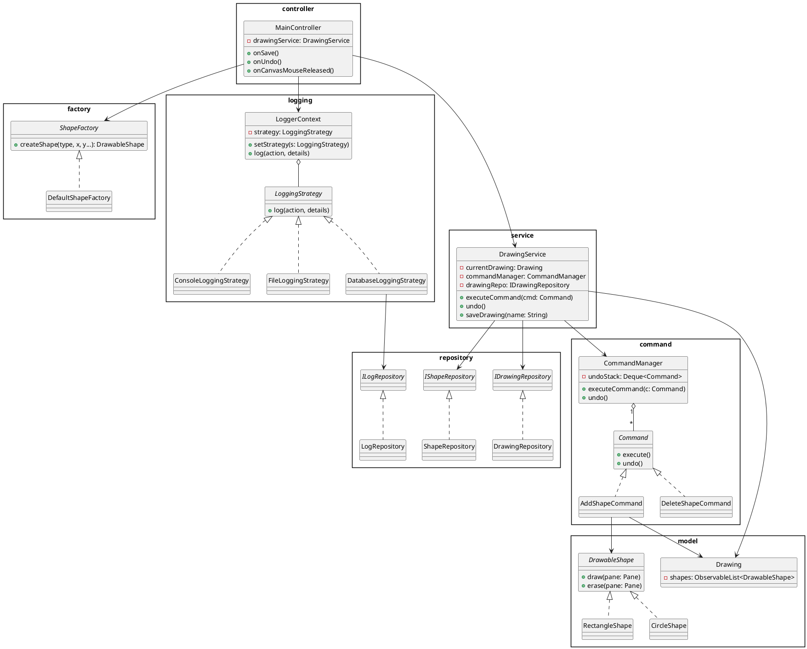
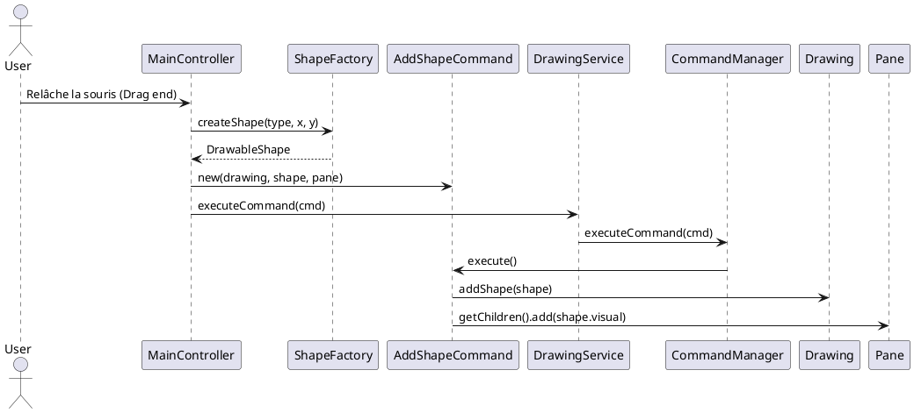
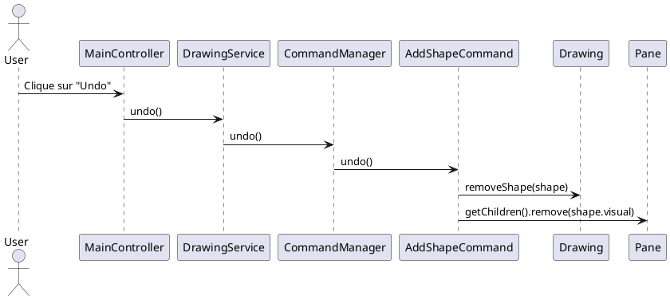
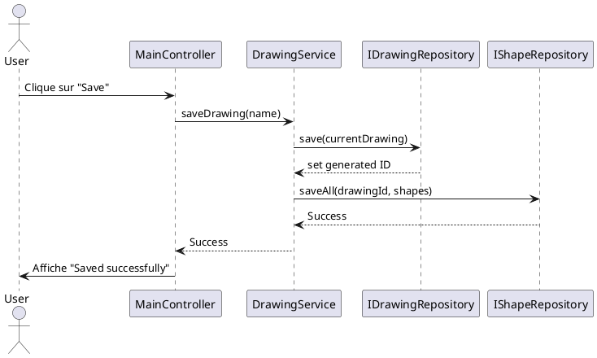
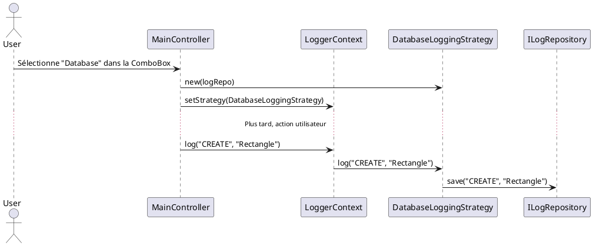

# Rapport de Mini-Projet : Application de Dessin JavaFX (MASI)

## 1. Introduction et Conformité au Cahier des Charges

L'objectif de ce projet est de réaliser une application JavaFX permettant de sélectionner et dessiner des formes géométriques, tout en respectant une architecture propre basée sur les **Principes SOLID** et les **Design Patterns**.

L'application répond intégralement aux exigences du professeur :
1. **Sélectionner une forme** : Palette disponible à gauche (Rectangle, Cercle, Ligne, Noeud, Arête).
2. **Dessiner une forme** : Action `Drag & Drop` (ou clics pour le graphe) gérée dans la zone de dessin centrale.
3. **Annuler une action** : Stack d'annulation gérée par le *Command Pattern*.
4. **Effacer une forme** : Sélection d'une forme puis suppression (également annulable).
5. **Enregistrer / Ouvrir** : Sauvegarde dans une base SQLite via le *DAO / Repository Pattern*.
6. **Journaliser (Logging)** : Enregistrement de toutes les actions (création, annulation, sauvegarde...).
7. **Stratégies de Journalisation** : Choix dynamique entre Console, Fichier texte, et Base de données via le *Strategy Pattern*.
8. **Étude de cas Optionnelle (Graphes)** : Possibilité de dessiner des nœuds et des arêtes pondérées, et de trouver le plus court chemin en choisissant l'algorithme (Dijkstra ou BFS) via le *Strategy Pattern*.

---

## 2. Diagramme de Classes UML (Architecture Globale)

Voici le diagramme de classes illustrant l'intégration des 6 Design Patterns utilisés.

---

## 3. Les Design Patterns Utilisés

### A. MVC (Model-View-Controller)
- **Où ?** `main-view.fxml` (Vue), `MainController` (Contrôleur), `Drawing` & `DrawableShape` (Modèle).
- **Pourquoi ?** Séparer l'interface graphique (JavaFX) de la logique métier et des données. 

### B. Factory Method
- **Où ?** Interface `ShapeFactory` et son implémentation `DefaultShapeFactory`.
- **Pourquoi ?** Le contrôleur n'utilise jamais l'opérateur `new` pour créer les formes géométriques. Cela respecte le principe **Open/Closed** : pour ajouter un Triangle, on modifie juste la Factory, sans toucher au contrôleur.

### C. Command Pattern
- **Où ?** Interface `Command`, classes `AddShapeCommand`, `DeleteShapeCommand`, et `CommandManager`.
- **Pourquoi ?** Permet d'encapsuler une requête sous forme d'objet. Indispensable pour implémenter la fonctionnalité **Annuler (Undo)**. Chaque commande sait comment s'exécuter et comment s'annuler.

### D. Strategy Pattern (Utilisé 2 fois)
- **Où ?** 
  1. **Logging** : `LoggingStrategy` (Console, File, Database).
  2. **Graphes** : `ShortestPathStrategy` (Dijkstra, BFS).
- **Pourquoi ?** Permet de changer le comportement d'un algorithme au moment de l'exécution (runtime). Le contrôleur déclenche le Logging ou le Chemin le plus court sans se soucier de l'algorithme sous-jacent.

### E. DAO / Repository Pattern
- **Où ?** `IDrawingRepository`, `IShapeRepository`, et `DatabaseManager`.
- **Pourquoi ?** Isoler le code d'accès à la base de données (SQL, JDBC). Le `DrawingService` ignore complètement si les données sont sauvegardées dans SQLite, MySQL ou un fichier.

### F. Observer Pattern
- **Où ?** Liste `ObservableList<DrawableShape>` dans la classe `Drawing`.
- **Pourquoi ?** L'interface JavaFX écoute automatiquement les modifications de cette liste pour se mettre à jour sans que le modèle n'ait besoin de forcer un rafraîchissement graphique.

---

## 4. Diagrammes de Séquence

### A. Dessiner une forme

### B. Annuler (Undo)

### C. Enregistrer le dessin

### D. Changement de Stratégie de Journalisation

---

## 5. Respect des Principes SOLID
- **Single Responsibility (SRP)** : Nous avons extrait la logique métier du `MainController` vers le `DrawingService`. Le `LogRepository` ne gère que les logs. Le `MainController` ne gère que les événements UI.
- **Open/Closed (OCP)** : La création de nouvelles formes et de nouveaux algorithmes de graphes se fait en ajoutant de nouvelles classes, sans modifier le code existant.
- **Liskov Substitution (LSP)** : N'importe quel `DrawableShape` peut être dessiné et annulé de la même manière par les Commandes.
- **Interface Segregation (ISP)** : Nous utilisons de petites interfaces dédiées : `ILogRepository` (2 méthodes), `Command` (2 méthodes), `ShapeFactory` (1 méthode).
- **Dependency Inversion (DIP)** : Le `DrawingService` et le `MainController` dépendent des interfaces (`IDrawingRepository`, `LoggingStrategy`), pas des implémentations concrètes (SQLite, Console).
